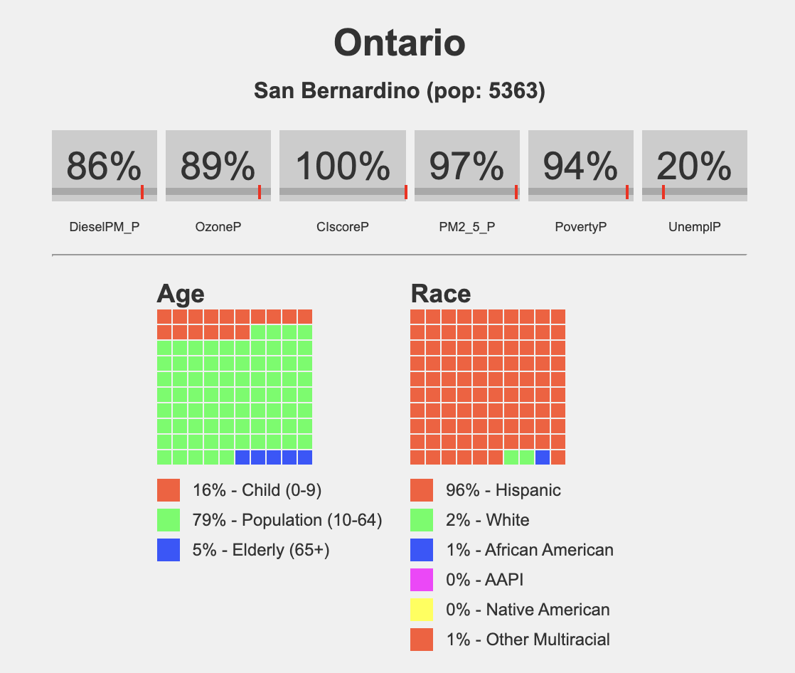

# **How to Use the Maproom**

The **Inland Empire Environmental Maproom** provides powerful tools to explore environmental challenges in the region. This guide explains the key features and how to interact with them effectively.

---

## **Interactive Environmental Layers**

The Maproom allows you to explore various environmental metrics using a set of interactive buttons. Each button corresponds to a specific environmental factor, such as Diesel PM, Ozone, or PM2.5.

### **Choosing Environmental Layers**
- **Red Buttons**: Select different environmental layers, as shown below:  
    

  Clicking a button activates the associated layer on the map, allowing you to view and analyze data for that specific environmental factor.

---

## **Warehouses and Time Navigation**

The Maproom includes a dynamic feature to toggle warehouse data on and off. When turned on, you can use the **time bar** to explore warehouses built by year.

### **How to Use This Feature**:
1. **Toggle Warehouses**: Turn the warehouse layer on using the control panel.
2. **Navigate Time**: Use the time bar to visualize changes in warehouse density over different years.

This feature helps you analyze trends in industrial development and their potential impacts on the surrounding environment.

---

## **Census Tract Profiles**

Hovering over census tracts dynamically generates **mini-community profiles**. These profiles provide detailed environmental metrics and demographic data for the selected area.

### **Information Included**:
- **Environmental Metrics**: Displays values for factors such as air quality, pollution levels, and environmental risks.
- **Demographics**: Includes age and race distributions for the selected census tract.

This feature is ideal for identifying how environmental challenges disproportionately impact certain communities.

---

## **Explore the Maproom**
Use the tools above to dive deep into the environmental and demographic data affecting California’s Inland Empire. Click the button below to get started:

  <a href="./map.html" style="
    display: inline-block;
    background-color: #007BFF;
    color: white;
    font-size: 18px;
    font-weight: bold;
    padding: 12px 20px;
    text-decoration: none;
    border-radius: 5px;
    transition: background-color 0.3s ease;
  " onmouseover="this.style.backgroundColor='#0056b3'" onmouseout="this.style.backgroundColor='#007BFF'">
    Explore the Maproom
  </a>

